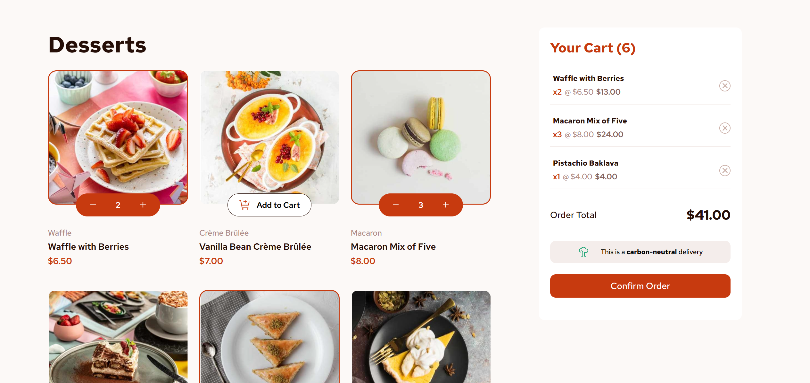
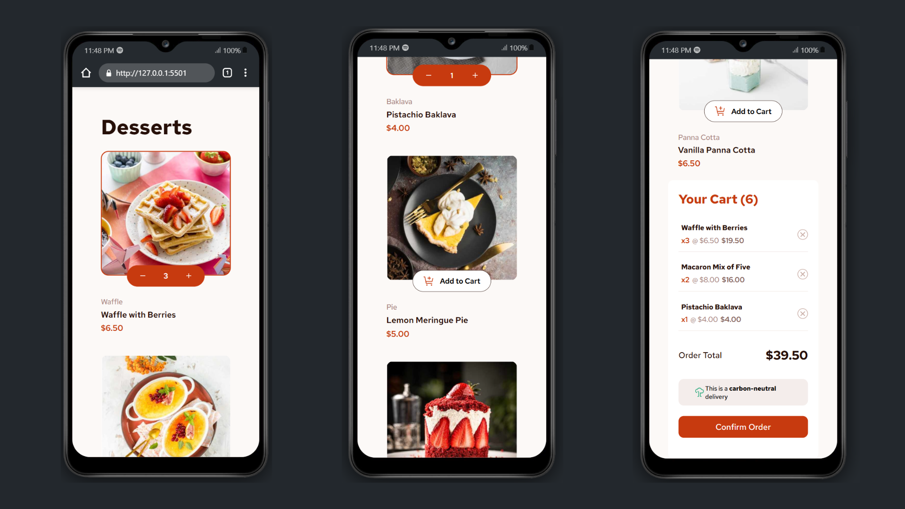

# 🛒 Product List with Cart



A simple yet responsive product listing page with an integrated shopping cart, developed using **HTML**, **CSS**, and **JavaScript**. Users can browse products, add items to the cart, and view the updated total in real time. The layout adapts smoothly to different screen sizes, ensuring an optimal shopping experience across devices.

## 🚀 Features

- Display a list of products with images, names, and prices
- Add products to the cart
- View and remove items from the cart
- Cart item count and total price updates dynamically
- Fully responsive design

## 🛠️ Tech Stack

- HTML5
- CSS3
- JavaScript (Vanilla)

## 💡 How to Use

1. Clone the repository:
   ```bash
   git clone https://github.com/Amine4jh/product-list-with-cart.git
   ```

2. Open the `index.html` file in your browser.

## 📱 Mobile View

